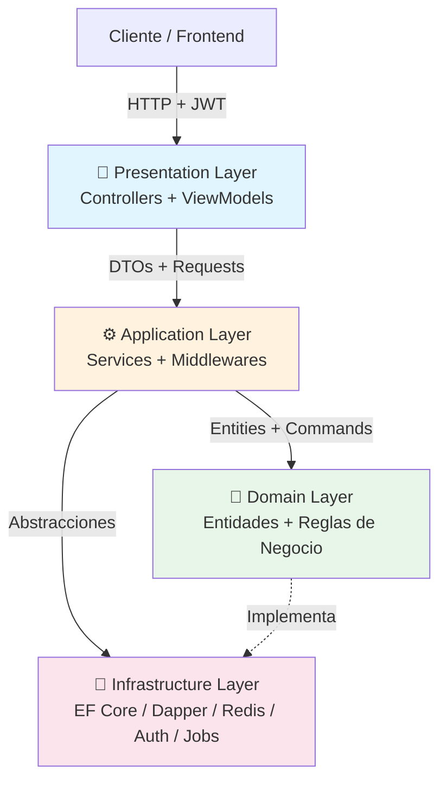
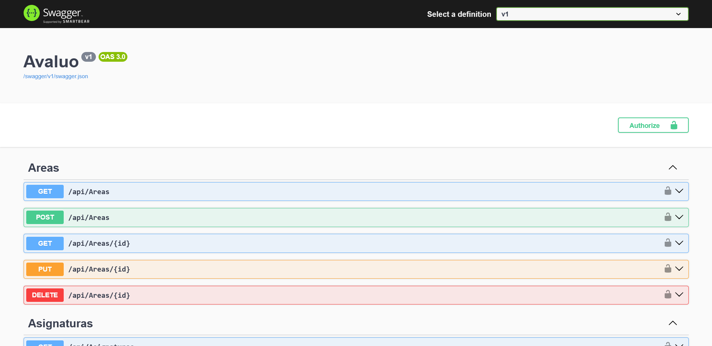
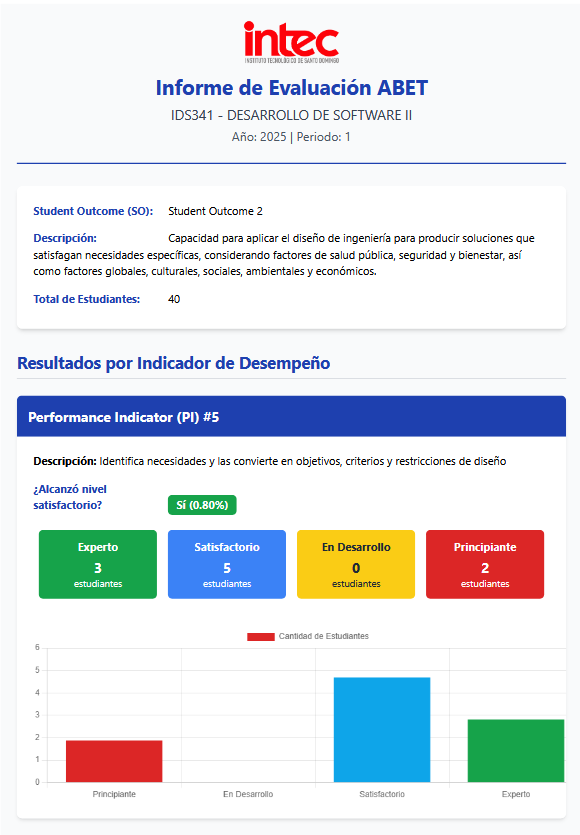
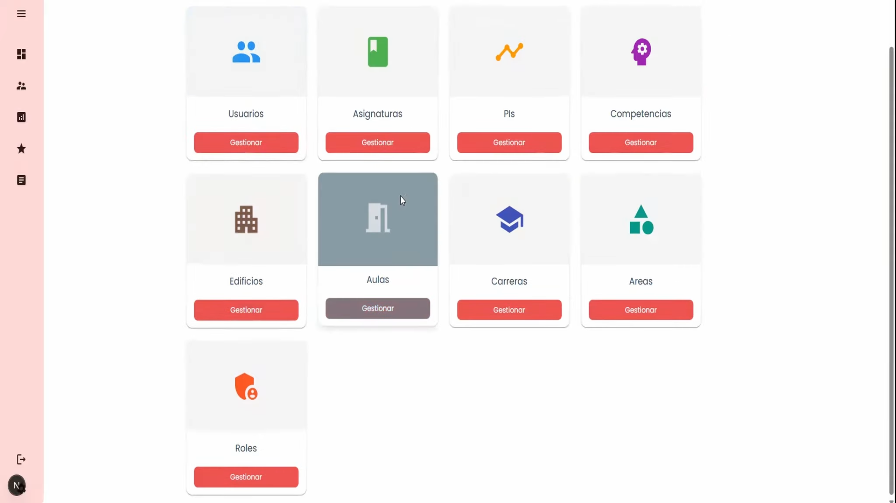

<h1 align="center">Avaluo Backend</h1>

<p align="center">
  
</p>

<p align="center">
  <strong>Sistema de Gestion de Avaluo de Desempeno — Backend API</strong>
</p>

<p align="center">
  <a href="https://dotnet.microsoft.com/en-us/download/dotnet/8.0"></a>
  
  
  
  <a href="LICENSE"></a>
  
  
  
</p>

---

## Descripcion

Avaluo es una plataforma de gestion academica orientada al **avaluo de desempeno universitario**. Facilita la evaluacion de competencias, Student Outcomes (SO) y Performance Indicators (PI) mediante rúbricas digitales, generacion automatica de informes en PDF y dashboards de seguimiento para coordinadores de carrera.

Este repositorio contiene el **Backend API** del sistema, desarrollado como parte de una tesis de grado.

> Repositorio original: [Tejanin/AvaluoBackend](https://github.com/Tejanin/AvaluoBackend)  
> Frontend (privado): [siriuzz/AvaluoUI](https://github.com/siriuzz/AvaluoUI)

---

## Caracteristicas principales

| | |
|---|---|
| 🔐 **Auth JWT + Roles** | Autenticacion y autorizacion con tokens JWT y permisos por roles. |
| 📋 **Rúbricas, SO y PI** | Gestion completa de rúbricas, Student Outcomes y Performance Indicators. |
| 📊 **Dashboards** | Resumenes de desempeno por carrera y periodo académico. |
| 📄 **Informes PDF** | Generacion automatica de informes con IronPDF y vistas Razor. |
| 🔗 **Integracion INTEC** | Sincronizacion de datos con sistemas externos de la institucion. |
| ⚡ **Cache Redis** | Cache distribuido para optimizacion de lecturas frecuentes. |
| ⏰ **Jobs Quartz** | Tareas programadas para procesos recurrentes y mantenimiento. |
| 🏗️ **Arquitectura DDD** | Capas separadas (Presentation, Application, Domain, Infrastructure). |

---

## Stack tecnologico

<p align="center">
  
</p>

| Capa | Tecnologia |
|---|---|
| Framework | .NET 8 Web API |
| ORM / Micro-ORM | Entity Framework Core 9 + Dapper |
| Base de datos | Microsoft SQL Server |
| Cache | Redis (StackExchange.Redis) |
| Autenticacion | JWT Bearer + Cookies seguras |
| Documentacion API | Swagger + Swashbuckle |
| Generacion PDF | IronPDF |
| Mapeo | Mapster |
| Jobs | Quartz.NET |
| Contenedores | Docker Compose (Redis) |

---

## Arquitectura



- **Presentation**: Controladores REST, ViewModels y filtros de validacion.
- **Application**: Servicios de aplicacion, DTOs, middlewares de excepcion y autenticacion.
- **Domain**: Entidades, value objects y reglas de negocio puras.
- **Infrastructure**: Persistencia (EF Core + Dapper), cache Redis, autenticacion JWT, integraciones INTEC y jobs Quartz.

Para mas detalles, consulta la [documentacion completa](https://RayfelO.github.io/AvaluoBackend) o el archivo [`CONTRIBUTING.md`](CONTRIBUTING.md).

---

## Contributors

<p align="center">
  <a href="https://github.com/RayfelO/AvaluoBackend/graphs/contributors">
    
  </a>
</p>

---

## Capturas y Demo

> El backend expone una API REST documentada con Swagger. A continuacion, una demostracion del sistema en accion:

<p align="center">
  <a href="https://youtu.be/CVELSReGrLg">
    
  </a>
</p>

<p align="center">
  <a href="https://youtu.be/CVELSReGrLg">Ver demo en YouTube</a>
</p>

### Screenshots

<p align="center">
  
  <br>
  <em>Documentacion interactiva de la API con Swagger UI</em>
</p>

<p align="center">
  
  <br>
  <em>Generacion automatica de informes en PDF</em>
</p>

<p align="center">
  
  <br>
  <em>Interfaz del cliente conectado al backend</em>
</p>

- **Swagger UI**: `https://localhost:8000` (al ejecutar localmente)
- **Documentacion tecnica**: [GitHub Pages](https://RayfelO.github.io/AvaluoBackend)

---

## Requisitos previos

- [.NET 8 SDK](https://dotnet.microsoft.com/en-us/download/dotnet/8.0)
- [Docker Desktop](https://www.docker.com/products/docker-desktop/) (para Redis)
- SQL Server (local o remoto)

---

## Como ejecutar localmente

### 1. Clonar el repositorio

```bash
git clone https://github.com/RayfelO/AvaluoBackend.git
cd AvaluoBackend
```

### 2. Levantar Redis

```bash
docker-compose up -d
```

### 3. Configurar secrets

Copia el archivo de ejemplo y completa los valores necesarios:

```bash
cp AvaluoAPI/appsettings.example.json AvaluoAPI/appsettings.json
```

Ajusta las `ConnectionStrings` y las claves de `Jwt`, `Email` e `IronPdf`.

### 4. Ejecutar la API

```bash
cd AvaluoAPI
dotnet run
```

La API estara disponible en:
- **API**: `https://localhost:8000`
- **Swagger UI**: `https://localhost:8000` (raiz)

---

## Estructura del proyecto

```
AvaluoBackend/
├── AvaluoAPI/
│   ├── Presentation/
│   │   └── Controllers/
│   ├── Application/
│   │   ├── Services/
│   │   └── DTOs/
│   ├── Domain/
│   │   ├── Entities/
│   │   └── Services/
│   └── Infrastructure/
│       ├── Persistence/
│       ├── Integrations/
│       └── Data/
├── docker-compose.yml
├── docs/
└── assets/
```

---

## Documentacion

La documentacion tecnica del proyecto esta disponible via **GitHub Pages**:

[**Ver documentacion →**](https://RayfelO.github.io/AvaluoBackend)

Tambien puedes consultar:
- [`CONTRIBUTING.md`](CONTRIBUTING.md) — Estandares de codigo, flujo Git y estructura de carpetas.
- [`docs/`](docs/) — Fuente de la documentacion en GitHub Pages.

---

## Licencia

Este proyecto esta licenciado bajo la [Licencia MIT](LICENSE).

---

> Desarrollado como tesis de grado. Fork del proyecto original con mejoras y documentacion adicional.
